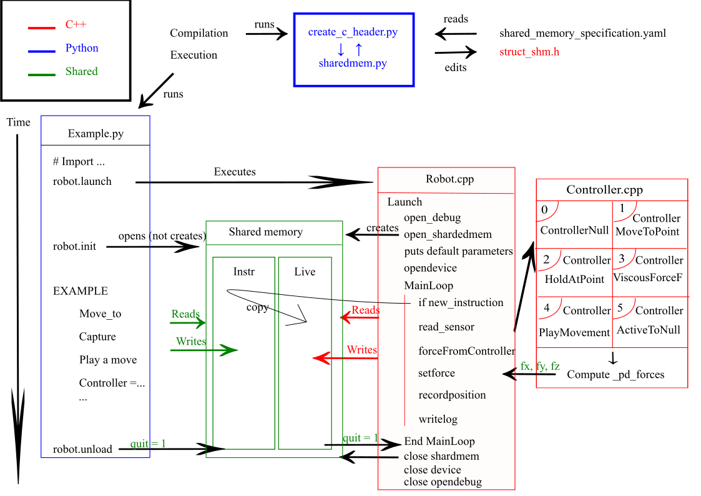

# Omega C++ / Python code

This code is developed in collaboration with Mathilde Chaplain and Simon Subias as part of their internships at the Motor Control Lab. This is a simple interface for the Omega Robot. It is implemented in Python 2 but the part which controls the robot is still in C++.


## Requirements

Python 2 with the following modules:

* `subprocess` which is used to launch the C++ part of the code.
* `numpy` for numeric computation.
* `mmap` for creating the shared memory and accessing it.
* `pyaml` to parse the shared memory specification

These last can be install easily using the command `sudo apt-get install python-<module's name>` or using `pip`.

We have been running this on a 64-bit version of Xunbuntu 16.04.02, running kernel `4.4.0-87-generic`.

To run the robot you also need to install libusb1, under Ubuntu this can be achieved through `sudo apt install libusb-1.0-0-dev`.

To install the right compiler g++ you just have to use the command `sudo apt-get install build-essential`


## Usage

### Switch between the lab and the hospital

The Omega in the lab and the Sigma in the Jewish hospital aren't using the same SDK, they use different headers and libraries. To switch from one to the other, you just have to put "lab" or "hosp" in the FLAG in the `makefile`.


### Usage with the Omega robot

The library used here is an updated version of `dhd-3.2.2.1466-linux-x86_64.tar.gz`. The manufacturer sent us a version that actually compiles under Ubuntu 18 as well. But you can download the official one which only compiles under Ubuntu 16 [download here](http://www.forcedimension.com/download/sdk).


Turn on the Omega robot using the switch in the back. One of the two front LEDs will blink. Press the `RESET` button on the robot controller box, while holding the robot to the most extreme front position (pulling it all the way towards you). Then you can press the button that enables the forces. Now you should be good to go.

The robot C++ scripts (`BasicRobot.cpp` and `Robot.cpp`) are in the principal folder (`omega_cpp_py/`) and need to be compiled. For this, you need to be in this directory and write this command from the prompt:

```
make
```


You can create your own python script to control the robot using the simple functions in `robot.py`. For example :

```python
import robot
import time

robot.launch() # launches the robot C++ script
robot.init()   # initialises shared memory

robot.move_to(0.01,0.02,0,2) # move to point (x=0.01,y=0.02,z=0.) in t=2 seconds.
while (robot.move_is_done() == False):
  pass  #wait until the end of the movement
robot.hold_at() #Keep the robot at the position
time.sleep(2) # during 2 seconds

robot.unload() #Stop the C++ script
```


### Usage with the Sigma robot

The Sigma robot at the hospital is working with another version of the SDK : `sdk-3.7.0.3146-linux-x86_64-gcc.tar.gz` which you can [download here](http://www.forcedimension.com/download/sdk).

1. Put the robot in the central top position (should be there by default anyway)
2. Switch on the robot controller box (grey box)
3. Press the "forces on/off"  button for two seconds until the green LED stops blinking and becomes on all the time (this is the calibration step)
4. Launch the robot code (Python)
5. Note that when you launch the robot from within Python, it starts in no-force mode, which you can see from the red LED "forces on/off" being off. So you will have to press the "forces on/off" button to enable the forces, before going on with your experiment code.


If you don't do 2, then you can find the robot device, but you cannot read meaningful positions (you just get the same position values x,y,z all the time). This is because pressing the force button also calibrates the position sensors (we think).


#### Notes

dmesg should tell you something like this when you connect the USB of the robot

```
[  454.224284] usb 2-1.6: USB disconnect, device number 3
[  456.648018] usb 2-1.6: new high-speed USB device number 4 using ehci-pci
[  456.758306] usb 2-1.6: New USB device found, idVendor=1451, idProduct=0401
[  456.758309] usb 2-1.6: New USB device strings: Mfr=1, Product=2, SerialNumber=0
[  456.758312] usb 2-1.6: Product: sigma.7 Haptic Device
[  456.758314] usb 2-1.6: Manufacturer: FD 3.x
```


## Loading as a subdirectory

What I recommend is that you keep your own code separate from this robot code. The reason for this is that the Python-C++ robot interface code may evolve and so you may want to easily take a newer version of the robot code and replace it in your own experiment code.

In order to achieve this, here is what I suggest.

1. Create a directory that holds your experiment, for example `experiment_A`.

2. Inside `experiment_A`, clone this repository.

```
cd experiment_A
git clone https://github.com/florisvanvugt/omega_cpp_py.git
```

3. Create your experimental script, for example `experiment_A/run.py`. Inside this file, use the following syntax to use the robot:

```python
import omega_cpp_py.robot as robot
robot.launch()
robot.init()
# Your code here
robot.unload()
```

In this way, when the `omega_cpp_py` code is updated, you can simply replace the `omega_cpp_py` directory with the latest version, and your code should run correctly.

Before launching your script, you have to make sure you compile the robot code, which you can do from the folder `experiment_A` by calling `make -C experiment_A`.


## Files

All the files C++ and python need to be in the same folder to be executed.

Core files:

* `BasicRobot.cpp` and `Robot.cpp` -- contains all the C++ code which controls the robot at a lower level than Python code.
* `shared_memory_specification.yaml` -- specifies the structure of the shared memory. This is read both by Python and by C++. You can freely add your own variables but be careful when you remove existing variables since some of the code may depend on them.
* `create_c_header.py` -- create the C++ header file which contains the structure of the shared memory for the C++ code
* `sharedmem.py` -- infrastructure for accessing the shared memory
* `robot.py` -- contains simple functions to control the robot

* `lib/libdhd.a` -- contains the proprietary robot code (pre-compiled)
* `include/libdhd.h` -- idem, header file

Further, various examples are provided in the form of scripts we call `example_<something>.py`. Take a look at these for inspiration. You can always remove these files since they are not part of the core.


## Under the hood

To control the robot main loop iteration time (the number of cycles per second) you can adjust `MAIN_LOOP_TIME_S = .0025;` which is defined in `Robot.h`.


### Recording a trajectory

Quite simple, call `robot.start_capture()` and some time later, `robot.stop_capture()`, the latter function will return a list of captured positions, coded as a tuple `(x,y,z)`.
However `robot.start_capture(False)` will just return this list and `robot.start_capture(True)` will return this list and stop the capture.


### Writing your own controller

Fairly easy: you can add code for your controller to `Controllers.cpp`. A controller is a function that takes the shared memory as argument and returns a triplet of forces (`setforce_t`). These forces are then applied by the robot code as part of the main loop. Which controller is executed at any given time is specified in the function `forceFromController`. Essentially, this function looks what controller number is currently set in the shared memory, and then depending on that calls a function in `Controllers.cpp` to actually compute the forces.

To activate the controller from within Python, call `robot.controller(N)` where `N` is the number you assigned to your controller.


## Shared memory

In reality, the robot can only be controlled by a C++ program. But we want to run the experiment with python, that is why we need to use a shared memory. In the `shared_memory_specification.yaml` document, we write the parameter that we want to add in the shared memory. `create_c_header.py` creates the C++ header file which contains the structure used by the C++ script to write into the shared memory. The C++ program create a shared memory after having computed the size of this one thanks to the `shared_memory_specification.yaml`. From within Python, it is quite easy to access to the shared memory. Actually, to read a parameter, you can use this function `robot.rshm(variable's name)`, and to write in this one, you need to use the function `robot.wshm(variable'name, value)`.

Each line in the `shared_memory_specification.yaml` creates one variable in the shared memory. Each variable has a name and a type. The types conform to the `struct` specification in Python ([see here for a specification](https://docs.python.org/2/library/struct.html#format-characters)).

For example, the line
```
x : d
```

creates a variable named `x` which has a double floating point precision value.

You can then access this variable in C++ as `shared_memory->x` and you can read/write to it in Python using `rshm('x')` and `wshm('x',value)`.


Lists of values can be created using:
```
record_x : 4000d
```

which creates a list of 4000 doubles, for example to hold a trajectory in shared memory.

IMPORTANT: In the `shared_memory_specification.yaml`, you can only put long int or double because C++ allocates only trunks of 8 bytes. if you put a int which takes 4 bytes and then a double, the double's address is going to be 4 bytes higher. As it is not the case in python, this is a problem because parameters in the shared memory did not have the same address' offset.

For more information about memory alignment, see e.g. [some Stack overflow discussion](https://stackoverflow.com/questions/5435841/memory-alignment-in-c-structs) and many other pages online.


### Instruction vs. live memory

The program edits two different shared memories: instruction and live. Python is able to write in the instruction shared-memory and to read in the live shared memory. C++ is able to read both and is able to write only in the live memory. The variables in the `shared_instruction_memory` are existing in the `shared_live_memory` but they are copied into the live memory when the number `instruction_no` is incremented. Therefore we don’t have concurrency problem because when the C++ detect a new instruction that will block the loop until all the instructions are loaded. Moreover it is a protection, we cannot access to the live memory anymore with Python and the C++ is not able to change the initial instruction.

When you send a new instruction (i.e. you increment `instruction_no`) then a set of variables is copied from the instruction shared memory into the live memory, at which point the robot will start following those instructions. However, note that not *all* variables are copied from the instruction to the live memory (if that happens, recording would interfere with other controllers, potentially). Instead, variables come in groups defined in `variable_groups.yaml`. 
For example, this line defines a variable group:

```
2 : ["stiffness", "damping", "target_x","controller"]
```

The number of that group is `2`, so within Python, when we send a new instruction set, we should call `wshm('prefix',2)` which will tell C that it needs to push the variables from the above group into the live memory.


## Protection

If the target is out of the robot limits or requires too much speed move_to, hold_at or play_movement fail and the movement_canceled flag in the shared memory warns Python of this failure. Before define a movement it checks this movement_canceled flag. The x,y,z limits and velocity limit are parameters and can be defined in robot.cpp in the launch function. There is also a function protection in the C code which can be activated but it is now a commentary. It calls the controller null if the desired_position is too far from the current position.


## Schema




## Issues / TODO
- [ ] **Logging to a specified file** Currently we log to `log.csv` always. However, I am starting to think we should do logging only through Python pulling from shared memory, because in this way you have access to data immediately and don't need to search through the robot log after the fact.
- [x] **Allow comments in shared memory specification**
- [ ] **Benchmark testing** of desired trajectory and actually produced trajectory.
- [ ] **Mock Inmotion** with some adjustments, we could pretend this is a planar robot and use it to test Inmotion2 code.
- [ ] **Super-user** do we have to be that to launch the robot code?
- [ ] **Instability** of the servo control - I wonder what this is due to?
- [x] Separate the user-defined controllers from the rest of the code
- [x] Use YAML style shared memory declaration.


## Programmer's notes

Sometimes, when the program is not well-closed, the Robot C++ process can stay opened. In this case, if you execute again the program, it will not be able to open the device.

In this case you can try and run `make quit` which will send the robot the instruction to quit through the shared memory. If this does not work, you can run `make kill` which will attempt to kill the robot process (the hard way).

If for some reason the robot is no longer listening to the shared memory, you need to kill the Robot process manually from the prompt.
For that, you have to invoke the command `ps -Al`, looking for the robot process' ID and then, you need to do `sudo kill <ID>`.
